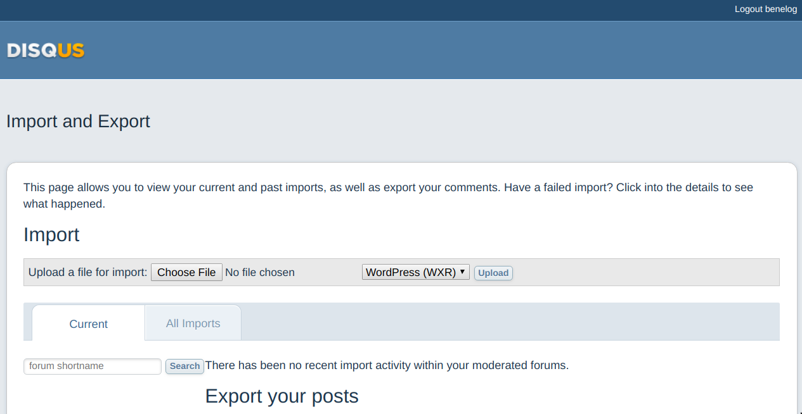
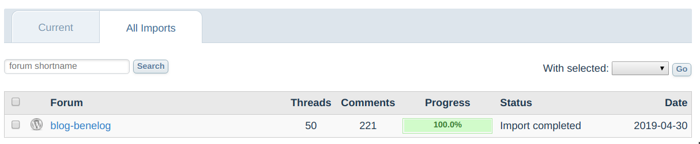

:version: 1.0.1

= egloos-migration
[Egloos](http://www.egloos.com/) 블로그 마이그리에션 프로그램. 아래 기능을 제공합니다.

* Egloos의 포스트를 XML형식으로 일괄 다운로드하기
* Egloos의 포스트를 https://jbake.org/[JBake]에서 사용가능한 AsciiDoc 형식으로 변환하기
* Egloos 포스트의 댓글를 Disqus로 마이그리에션 가능한 XML 형식으로 일괄 다운로드하기

== 사용법
Java8 이상이 설치된 시스템에서 이 프로그램을 실행할 수 있습니다.

### jar 파일 얻기
https://github.com/benelog/egloos-migration/releases 에서 다운로드할 수 있습니다.

혹은 아래와 같이 이 저장소를 복제한 후 직접 빌드를 해서 jar 파일을 생성합니다.

[source]
----
git clone git@github.com:benelog/egloos-migration.git
cd egloos-migration
./gradlew build
# build/libs 경로에 jar 파일이 생성됨.
----

`java -jar migration-{version}.jar` 과 같이 실행해서 도움말이 나온다면 이어지는 작업을 실행할수 있는 상태입니다.

=== A. 포스트 일괄 다운로드

`java -Dspring.batch.job.names=download -jar migration-{version}.jar egloosAccount={Egloos 계정}`

- `{Egloos 계정}` : 블로그 주소가 benelog.egloos.com 이라면 `benelog` 를 입력합니다.

실행이 성공하면 `./download` 경로에 Egloos의 API가 제공하는 형식대로 XML 파일로 포스트의 데이터가 다운로드됩니다.

=== B. AsciiDoc 형식으로 변환
A 단계의 작업이 완료되어 있어야 실행할 수 있는 작업입니다.
XML 형식으로 다운로드한 포스트의 정보를 JBake에서 사용할 수 있는 AsciiDoc 파일 형식으로 변환합니다.

이 작업을 실행하기 전에는 https://pandoc.org/installing.html[Pandoc]이 설치되어 있어야합니다.
Pandoc 버전 2.7.1 이상을 권장합니다.

`java -Dspring.batch.job.names=convertToAsciiDoc -jar migration-{version}.jar`

실행이 성공하면 `./output` 위치에 AsciiDoc 형식의 파일이 생깁니다.

=== C. 코멘트 일괄 다운로드
A 단계의 작업이 완료된 후에 실행할 수 있는 작업입니다.

`java -Dspring.batch.job.names=exportComment -jar migration-{version}.jar egloosAccount={Egloos 계정} parentTargetUrl={옮길 페이지의 루트 URL}`

- `{Egloos 계정}` : 블로그 주소가 benelog.egloos.com 이라면 `benelog` 를 입력합니다.
- `{옮길 페이지의 루트 URL}` : 포스트가 올라갈 홈페이지의 주소 루트 URL. 마지막 `/` 는 제외하고 입력한다. 예) https://blog.benelog.net

실행이 성공하면 `./disqusComments_{timestamp}.xml` 파일이 생성됩니다.

이 파일을 https://import.disqus.com 를 통해 업로드할 수 있습니다.

==== Disqus로 댓글 올리기
1. https://disqus.com/ 에서 가입과 로그인을 합니다.
2. https://disqus.com/admin/create/ 에서 Site를 생성합니다.
3. https://import.disqus.com 로 이동해서 Site를 선택합니다.
4. `Choose File` 버튼을 클릭한 후 `disqusComments_{timestamp}.xml` 파일을 선택합니다.
5. `WordPress (WXR)`을 선택한 후 `Upload` 버튼을 누릅니다.

6. `All imports` 탭에서 진행 상황을 확인합니다.

==== Disqus와 연동할 때 페이지 식별자 지정
Disqus 댓글 플러그인은 기본적으로는 웹페이지의 주소를 식별자로 써서 해당 페이지에 달린 댓글을 연결시켜 줍니다.

https://www.netlify.com/[Netflify]나 Github Pages에서는 주소에서 `*.html` 확장자를 생략해도 컨텐츠를 접근할 수 있습니다.
즉 아래의 2개의 URL은 특별한 정책을 설정하지 않아도 동일한 페이지로 연결됩니다.

* https://blog.benelog.net/904735.html
* https://blog.benelog.net/904735

이 마이그레이션 프로그램에서 만든 데이터에서는 `.html` 확장자가 붙은 주소를 기준으로 포스트와 댓글이 연결되어 있습니다.
따라서 `.html` 확장자가 없는 주소로 접근했을 때 Disqus에서 위의 2가지 스타일의 주소가 동일한 페이지로 Disqus에 인식되도록 신경을 써야합니다.

JBake를 사용하는 blog.benelog.net에서는 아래와 같이 '${post.uri}'를 페이지 식별자로 지정해서 이 문제를 해결했습니다.

[source,javascript]
----
    var disqus_config = function () {
      this.page.identifier = '${post.uri}';
    };
----

전체 소스는 https://github.com/benelog/blog/blob/master/src/templates/commons/disqus.ftl[disqus.ftl] 을 참조합니다.

==  사용한 기술
=== Egloos API
* 포스트 API : http://apicenter.egloos.com/manual_post.php
** 예: 포스트 목록 : http://api.egloos.com/rousalome/post.xml
** 예: 포스트 상세 : http://api.egloos.com/rousalome/post/9995793.xml
* 덧글/답글 API : http://apicenter.egloos.com/manual_comment.php
* 예: 특정 포스트의 댓글 목록 : http://api.egloos.com/rousalome/post/9990129/comment.xml

=== Disqus
* XML import 포멧
** https://help.disqus.com/developer/custom-xml-import-format
** https://help.disqus.com/troubleshooting/troubleshooting-imports

=== Spring Batch
* https://docs.spring.io/spring-batch/trunk/apidocs/org/springframework/batch/item/file/MultiResourceItemReader.html[MultiResourceItemReader]
* https://docs.spring.io/spring-batch/trunk/apidocs/org/springframework/batch/item/xml/StaxEventItemReader.html[StaxEventItemReader]
* https://docs.spring.io/spring-batch/trunk/apidocs/org/springframework/batch/item/xml/StaxEventItemWriter.html[StaxEventItemWriter]

== 기능 확장
아래 기능들은 http://blog.benelog.net 의 마이그리에션에는 필요하지 않아서 구현하지 않았습니다. 필요하신 분들은 아래 정보를 참고하셔서 직접 구현하실 수 있습니다.

=== Markdown으로 변환
https://github.com/benelog/egloos-migration/blob/master/src/main/kotlin/net/benelog/blog/migration/etl/JbakeAsciiDocProcessor.kt[JbakeAsciiDocProcessor.kt]를 참조하셔서 AsciiDoc 대신 Markdown으로 컨텐츠를 변환할 수 있습니다.

pandoc를 이용한 구현체는 https://github.com/benelog/egloos-migration/blob/master/src/main/kotlin/net/benelog/blog/migration/etl/HtmlToMarkdownConverter.kt[HtmlToMarkdownConverter.kt]에 작성해 두었습니다.
pandoc대신 Java 구현체인 https://github.com/giflw/remark-java[Remark]를 활용하실 수도 있습니다.

=== 본문의 이미지 다운로드, 치환
이 마이그리에션 프로그램에서는 Egloos에 올라간 이미지는 포스트의 본문 안에서 절대 경로로 참조가 됩니다.
따라서 별다른 처리를 하지 않아도 이미지가 포함된 컨텐츠를 이사간 블로그에서 참조하는데에는 문제가 없습니다.

하지만 향후 Egloos의 블로그를 삭제하거나 Egloos의 서비스가 종료될 때까지 대비한다면, 이미지 파일까지도 모두 옮겨가는 것을 고려할 수 있습니다.

https://jsoup.org/[jsoup]을 이용하면 HTML을 파싱해서 이미지를 다운로드하고 참조하는 경로를 바꾸는 작업을 쉽게 할 수 있습니다.

[source,kotlin]
----

Document doc = Jsoup.parseBodyFragment(originalHtml)
for (image in doc.getElementsByTag("img")) {
    val src = image.attr("src")
    if (src.contains("egloos.net")) {
        // 다운로드
        image.attr("src", "대체할 경로")
    }
}

val processedHtml = doc.body().html()
----

https://blog.benelog.net 에서 참조하는 이미지 파일은 Dropbox, Github, 구 Springnote 등 다양한 곳에 산재해 있어서 이미지 파일을 수작업으로 정리했습니다.

== 참고할 사안
구현 과정에서 겪은 특이한 현상을 기록합니다.

=== Disqus API
처음에는 Disqus의 XML import를 사용하지 않고, Disqus에서 제공하는 API를 호출하여 댓글을 입력하려고 했었습니다.
그러나 Disqus API를 사용했을 때 아래와 같은 문제들을 겪었습니다.

* 과거의 날짜를 지정해서 API를 호출했을 때 응답 시간이 아주 느리거나 에러가 발생
* Disqus 계정과 연결되지 않는 Guest로 댓글을 생성하는 방법을 찾지 못했음.
** 과거에는 되었으나 어느 시점부터 제약이 생긴 것으로 추정됩니다.
** https://github.com/disqus/DISQUS-API-Recipes/commit/b0eaca0f1d025579d47cb6d4cb70e271ff9036ac[disqus/DISQUS-API-Recipes@b0eaca0] 에 `Due to changes in the posts/create API, guest comments should no longer be created server-side.
` 라는 문구가 있습니다.

이에 따라 더 안정되고 성능이 좋으며 Guest Comment로도 댓글을 옮길 수 있는 XML import 방식을 선택했습니다.

=== Kotlin 문자열의 `.trimIndent()`
`String.byteInputStream()` 을 호출하는 경우, 문자열에 `.trimIndent()`가 제대로 적용되지 않습니다.

아래과 같이 문자열을 `org.springframework.core.io.Resource` 안에 바로 넣어서 전달하려고 할때 이런 현상을 발견했습니다.

[source,kotlin]
----
    override fun process(post: EgloosPost): Resource {
        val content = convert(post)

        return object : InputStreamResource(content.byteInputStream()) {
            override fun getFilename() = "${post.no}.adoc"
        }
    }
----

Kotlin의 `.trimIndent()`은 문자열 내부의 Byte 배열까지는 건드리지 않는 Extension으로 작동하기 때문에 그런 것으로 추정됩니다.

이에 따라 https://github.com/benelog/egloos-migration/blob/master/src/main/kotlin/net/benelog/blog/migration/etl/JbakeAsciiDocProcessor.kt[JbakeAsciiDocProcessor.kt] 에서는
아래와 같이 문자열 내부에서 들여쓰기를 하지 않고 `trimIndent()` 도 쓰지 않았습니다.

[source,kotlin]
----
    private fun convert(post: EgloosPost): String {
        val asciiDoc = converter.convert(post.content)
        return """= ${post.title}
${post.nick}
${post.createdAt.format(formatter)}
:jbake-type: post
:jbake-status: published
:jbake-tags: ${post.tags}
:jabke-rootpath: /
:rootpath: /
:content.rootpath: /
:idprefix:

$asciiDoc
"""
        // String을 inputStream으로 읽어서쓰니 trimIndent가 안 먹음.
    }
}
----
